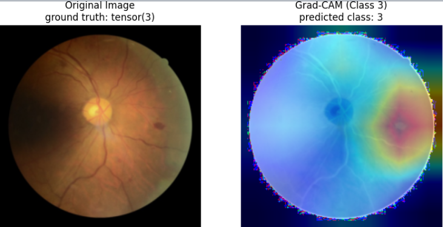

# DeepLearning

This is a project for the university of Oulu in the course; DeepLearning.

I am train a deep learning model to detect DR levels of retina images, and the objective is to explore what techniques may or may not improve the model.
I engage in transfer learning, treating a pair of images for getting one prediction, oversampling with image augmentations at random, three attention methods (self, channel, spatial), ensemble methods, preprocessing techniques, plotting metrics and the use of GradCAM for visualizing the output layers.

